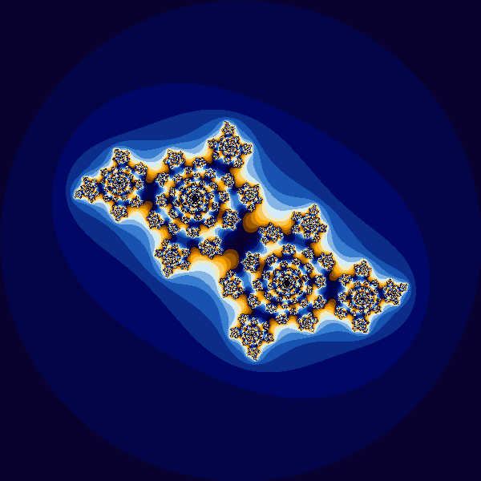
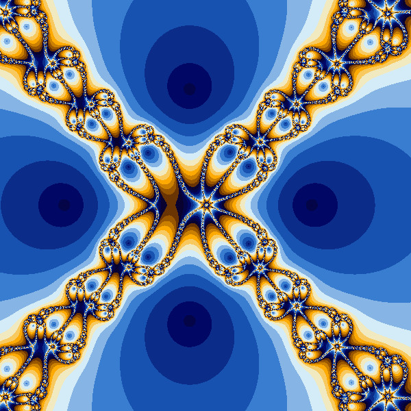
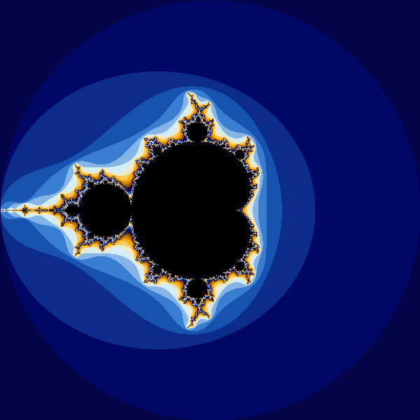
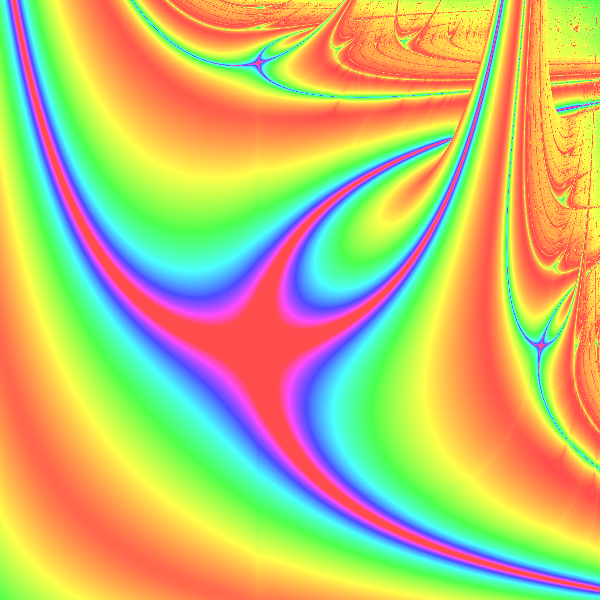

    
    <h3 align="center">Explorino</h3>

## Installation

To be added

## Requirements

Java 11 or higher is required.

## About

Explorino is a tool to explore a variety of Fractals by simple moving or zooming.
Precision goes as far as a 64-bit floating-point number for a zoomed in point allows.

You can save your favorite findings as `.png`-image.

Resolution and Computation depth can be selected.

### Fractals

Explorino supports following fractals:

| Fractal              | Description                                  | Formal Definition                                                                                          | Options                         |
|----------------------|----------------------------------------------|------------------------------------------------------------------------------------------------------------|---------------------------------|
| Mandelbrot/Multibrot | https://en.wikipedia.org/wiki/Mandelbrot_set | $c \in \mathbb{C}, d \in \mathbb{N}$ where $f_{c}(z) = z^d + c$ does not diverge starting with $z=0$       | - degree                        |
| Julia/Multijulia     | https://en.wikipedia.org/wiki/Julia_set      | $c,z \in \mathbb{C}, d \in \mathbb{N}$ where $f_{c}(z) = z^d + c$ does not diverge for a fixed parameter c | - degree - parameter c       |
| Newton/Nova          | https://en.wikipedia.org/wiki/Newton_fractal | $p(z) \in \mathbb{C}[z]$ with $f(z) = z - a \dfrac{p(z)}{p'(z)} + c$ for fixed $a,c$                       | - up to 5 variable coefficients |

### Coloring

Explorino supports following coloring methods:

| Coloring                | Description                                                                | Options  |
|-------------------------|----------------------------------------------------------------------------|----------|
| Palette Coloring        | Coloring based on convergence given by a pre choosen custom color palette. |          |
| Argument Coloring       | Coloring based of the complex Argument of the last iteration.              | - invert |
| Absolute Value Coloring | Coloring based of the absolute value of the last iteration.                | - invert |
| Basic Coloring          | Coloring based on convergence and Hue of the HSV Model.                    |          |

## Gallery

## Built with

- [JavaFx](https://openjfx.io/)
- [Maven](https://maven.apache.org/)

## License

MIT License

